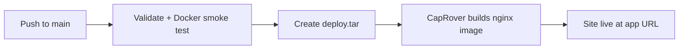

# CapRover deployment (GitHub Actions)

Pushes to `main` build a lightweight nginx Docker image and deploy it to CapRover. The pattern matches [awesome-soundboard](https://github.com/hackmods/awesome-soundboard) — source is uploaded as a tarball; CapRover builds on the server (no container registry).

## One-time CapRover setup

1. **Create the app** in the CapRover dashboard before the first deploy.
   - Use a short lowercase name, e.g. `dickie-lakeshore`
   - This name must match `CAPROVER_APP_NAME` **exactly**
2. Open the app → **Deployment** → **Enable App Token** → copy the token
3. Enable **HTTP** (port 80) — the Dockerfile exposes nginx on port 80
4. Point your domain (e.g. `dickie.yourdomain.com`) at the app in CapRover
5. No persistent directories or env vars are required — this is a static site

## GitHub secrets

| Secret | Required | Example | Notes |
|--------|----------|---------|-------|
| `CAPROVER_SERVER` | Yes | `https://captain.apps.example.com` | CapRover **dashboard** URL |
| `CAPROVER_APP_NAME` | Yes | `dickie-lakeshore` | Exact app name — not a URL |
| `CAPROVER_APP_TOKEN` | Yes* | (Deployment tab) | App deploy token |
| `CAPROVER_PASSWORD` | Optional | Captain password | Auto-creates app if missing |
| `CAPROVER_OTP_TOKEN` | Optional | 2FA code | Required if dashboard has 2FA |

\* Use `CAPROVER_APP_TOKEN` **or** `CAPROVER_PASSWORD`.

**Find `CAPROVER_SERVER`:** open the CapRover dashboard in your browser and copy that URL (not the app's public URL).

## How the pipeline works



On every push/PR to `main`, CI verifies required files exist and runs a Docker build smoke test (serves `index.html`, `shows.csv`, `app.js`).

On push to `main` only, CI uploads the repo tarball to CapRover. CapRover reads `captain-definition`, builds the nginx image from `Dockerfile`, and deploys it.

## Updating shows without redeploying

Set `SHOWS_CSV_URL` in `app.js` to a published Google Sheets CSV URL. Richard can update the sheet anytime — no redeploy needed.

## Troubleshooting

### 404 "Nothing here yet" on deploy

The app name in `CAPROVER_APP_NAME` does not exist on your CapRover server. Create it in the dashboard or add `CAPROVER_PASSWORD` so CI creates it on first run.

### Wrong server URL

| Wrong | Right |
|-------|-------|
| `https://dickie-lakeshore.apps.example.com` | `https://captain.apps.example.com` |
| Your app's public URL | CapRover dashboard URL |

### Build fails locally but works in CI

Run the same smoke test CI uses:

```bash
docker build -t dickie-lakeshore:local .
docker run -d --name dickie-test -p 8080:80 dickie-lakeshore:local
curl http://localhost:8080/shows.csv
docker rm -f dickie-test
```
